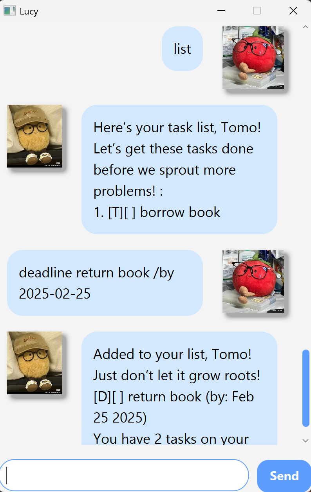

# Lucy User Guide



Lucy is a friendly potato that helps you manage your tasks efficiently. It supports adding, listing, marking, deleting and undo-ing tasks, including ToDos, Deadlines, and Events.

## Listing all tasks

**Command:** `list`

Displays all tasks in your task list.

**Example:**
```
> list
Here’s your task list, Tomo! Let’s get these tasks done before we sprout more problems! :
1. [T][ ] Buy groceries
2. [D][X] Submit assignment (by: Nov 20 2024)
```

## Adding deadlines

**Command:** `deadline TASK_DESCRIPTION /by YYYY-MM-DD`

Adds a Deadline task with a due date.

**Example:**
```
> deadline Finish project /by 2024-12-01
Added to your list, Tomo! Just don’t let it grow roots!
[D][ ] Finish project (by: Dec 1 2024)
You have 1 tasks on your list!
```

## Adding a ToDo task

**Command:** `todo TASK_DESCRIPTION`

Adds a ToDo task to your list.

**Example:**
```
> todo Read a book
Added to your list, Tomo! Just don’t let it grow roots!
[T][ ] Read a book
You have 2 tasks on your list!
```

## Adding an Event task

**Command:** `event TASK_DESCRIPTION /from START_TIME /to END_TIME`

Adds an Event task with a start and end time.

**Example:**
```
> event Team meeting /from 2pm /to 4pm
Added to your list, Tomo! Just don’t let it grow roots!
[E][ ] Team meeting (from: 2pm to: 4pm)
You have 3 tasks on your list!
```

## Marking a task as done

**Command:** `mark TASK_NUMBER`

Marks a specific task as completed.

**Example:**
```
> mark 1
Ooo! You finished a task! That's *spud-tacular*!
```

## Marking a task as not done

**Command:** `unmark TASK_NUMBER`

Marks a specific task as incomplete.

**Example:**
```
> unmark 2
Oopsie... We unmarked that. It’s okay! Potatoes sometimes forget things too!
```

## Deleting a task

**Command:** `delete TASK_NUMBER`

Removes a specific task from your list.

**Example:**
```
> delete 1
Chopping this task away… Hope it wasn’t too rooted in your plans!
```

## Finding tasks

**Command:** `find KEYWORD`

Searches for tasks containing the given keyword.

**Example:**
```
> find project
Here are the matching tasks, Tomo! :
1. [D][ ] Finish project (by: Dec 1 2024)
```

## Undoing the last action

**Command:** `undo`

Restores the last action performed.

**Example:**
```
> undo
Phew! I rolled things back like a good spud!
```

## Exiting the application

**Command:** `bye`

Exits the chatbot.

---